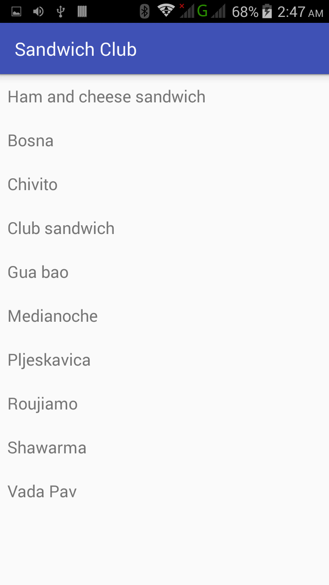
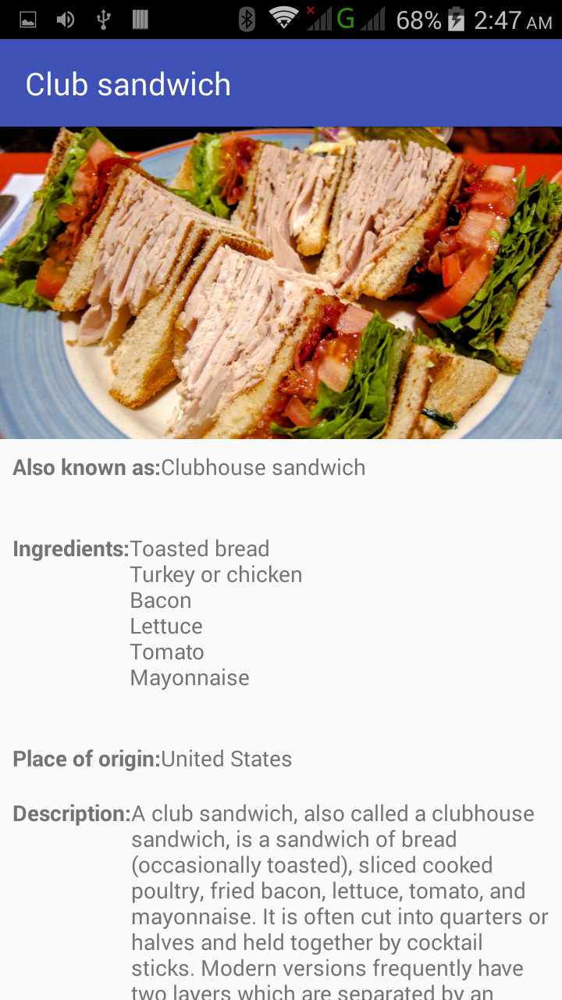

# Sandwich Club Project 
## Project Overview
In this project, you use the **Sandwich Club** app to
show the details of each sandwich once it is selected.

## HOW TO RUN

### when you open the app.

### then you select a sandwich.

## Implementation
Design the layout for the detail activity so the different elements
display in a sensible way. Implement the JSON parsing in JsonUtils so it
produces a Sandwich Object that can be used to populate the UI that you designed.
